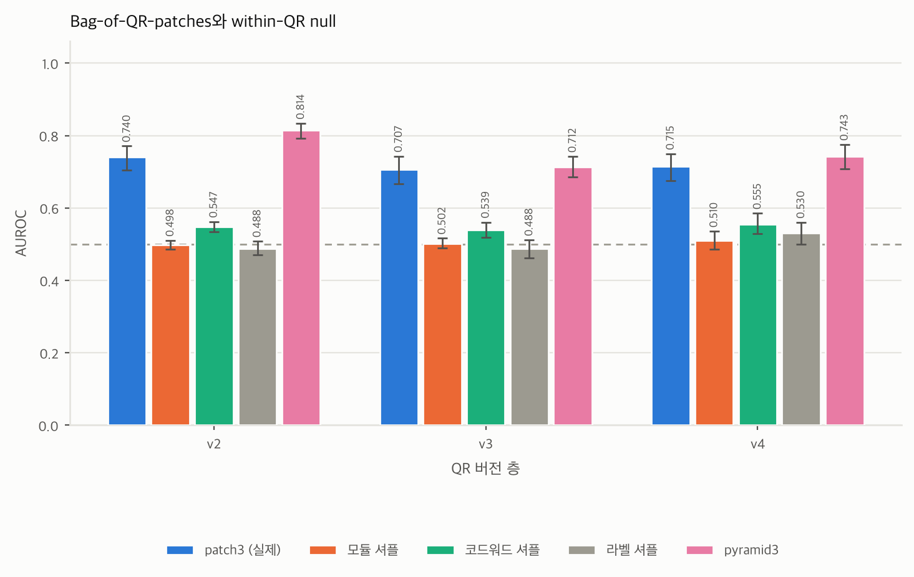
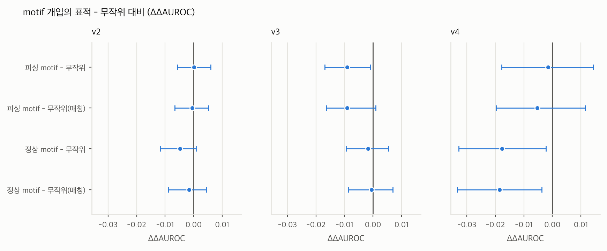
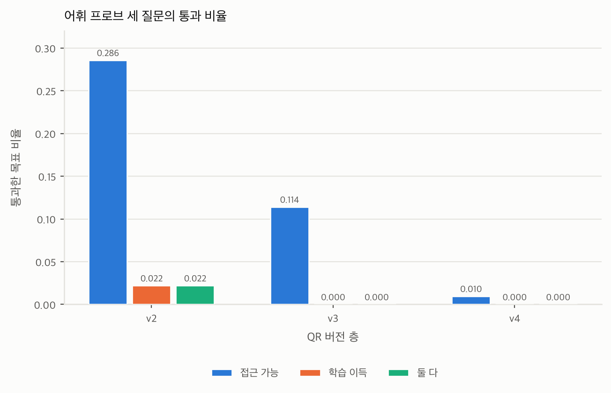
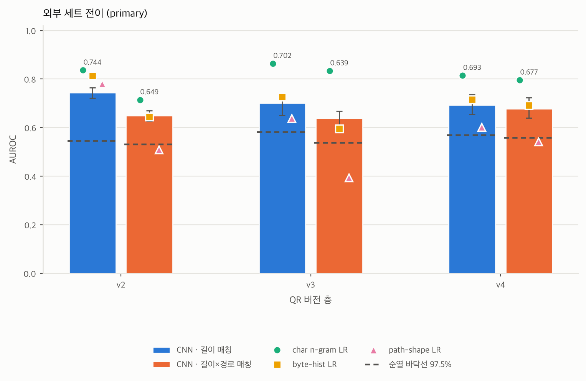
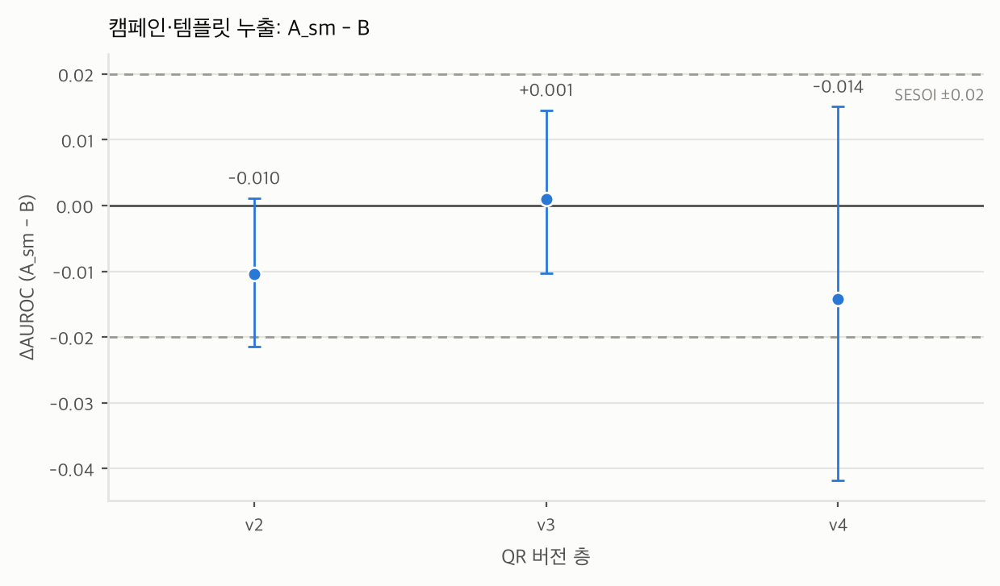

# 명시적 디코딩 없는 QR 기반 피싱 분류의 통제 평가: 공간 배치, 국소 패턴과 외부 일반화

영문 제목 후보

- A Controlled Evaluation of QR-Based Phishing Classification without Explicit Decoding: Spatial Layout, Local Patterns, and External Generalization
- Do Phishing URLs Leave Learnable Spatial Signals in QR Module Grids? A Controlled Study of URL-Derived Signal Learning without Explicit Decoding

교수 검토용 논문 초안. 수치는 저장된 실험 결과를 기준으로 작성했으며, `docs/REPORT.md`와 `docs/RESULTS.md`를 함께 대조했다. 상세 집계는 `reports/tables.md`와 `docs/REPORT.md`, 원자료 경로는 부록 A를 참조한다. 이하 세 층의 수치를 나란히 제시할 때는 별도 표기가 없으면 v2 / v3 / v4 순서다.

---

## 초록

본 연구는 URL을 명시적으로 디코딩하지 않고 QR 모듈 격자에서 피싱 여부를 분류할 때, 분류 성능을 뒷받침하는 신호의 특성과 일반화 범위를 평가한다. WebPhish의 URL을 정규화한 뒤 2채널 QR 모듈 격자로 변환하고, 길이와 QR 버전, 도메인 중복을 통제했다. 주 실험에서 SmallCNN의 AUROC는 v2, v3, v4 순으로 0.872 / 0.814 / 0.805였으며, 라벨 셔플 대조군은 약 0.50이었다. 별도의 캠페인 홀드아웃 실험에서는 도메인과 URL 템플릿을 모두 분리한 모델이 0.851 / 0.774 / 0.828을 기록했다. 두 실험은 평가 집합이 다르므로 통제를 누적한 단일 결과로 해석하지 않는다. 모든 표본에 동일한 위치 순열을 적용하고 재학습하면 CNN의 AUROC는 0.107 ~ 0.149 낮아졌지만 BitMLP의 변화는 작았다. 이는 원래 QR 배치가 해당 CNN의 학습에 유리함을 보여 준다. 3×3 패치 빈도에도 클래스와 연관된 차이가 있었으나, 피싱 관련 국소 패턴에 대한 표적 개입은 위치와 밀도를 맞춘 무작위 개입보다 일관되게 큰 성능 저하를 일으키지 않았다. 동결 표현의 선형 프로브에서는 일부 URL 속성을 예측할 수 있었지만, 피싱 분류 학습으로 예측력이 높아진 속성은 제한적이었다. OpenPhish와 Common Crawl로 구성한 외부 평가 집합에서 길이와 경로 유무를 함께 맞춘 결과, 재학습 없이 평가한 CNN의 AUROC는 0.649 / 0.639 / 0.677이었다. 이는 순열 대조 기준값보다 높았으나 같은 표본에서 평가한 문자 n-gram 로지스틱 회귀보다 낮았다. 이 결과는 QR 모듈 배치에 학습 가능한 판별 신호가 있음을 뒷받침한다. 다만 그 신호를 특정 국소 패턴의 인과적 기여나 데이터셋 전반에 통용되는 피싱 고유 패턴으로 해석할 근거는 충분하지 않다.

---

## 1. 서론

QR 코드는 입력 문자열을 보존하는 인코딩이며, 생성 조건이 같으면 동일한 문자열은 동일한 격자로 변환된다. 그러나 정보가 보존된다는 사실만으로 제한된 크기의 CNN이 그 정보를 학습해 피싱 여부를 분류할 수 있다고 단정할 수는 없다. URL에 라벨을 예측하는 정보가 있는지, 그리고 CNN이 명시적 디코딩 없이 그 정보를 학습할 수 있는지는 구분해서 평가해야 한다. 또한 분류에 성공하더라도 곧바로 피싱에 고유한 시각 패턴을 발견했다고 볼 수는 없다.

본 연구는 QR 분류 성능의 존재와 그 성능에 대한 해석을 구분하기 위해 다음 세 가지 연구 질문을 설정했다.

- **RQ1.** 길이와 QR 버전, 패딩 경계의 클래스별 분포를 통제한 뒤에도 QR 모듈 격자에 판별 가능한 신호가 남는가.
- **RQ2.** CNN이 명시적 QR 디코딩 없이 QR의 공간 배치를 이용해 URL 유래 내용과 순서 신호에 선형으로 접근 가능한 표현을 학습하는가.
- **RQ3.** 그 신호가 여러 피싱 QR에서 반복되는 국소 패턴(motif)으로 나타나며 새로운 도메인과 데이터셋에서도 재현되는가.

연구의 동기는 저자가 앞서 수행한 소규모 캡스톤 실험에 있다. 그 실험은 길이, 생성 조건, 데이터 출처를 통제하지 않고 음성 대조군도 두지 않아 어떤 가설이 지지되었는지 판정할 수 없었다. 그래서 이 연구는 같은 가설을 통제 실험으로 다시 평가한다(지표와 데이터 구성이 달라 두 실험의 수치를 직접 비교하지 않는다).

본 연구의 주요 기여는 다음과 같다.

1. **통제된 QR 표현 평가.** QR 버전 층화, 각 분할 집합 안의 1바이트 버킷 길이 주변분포 일치, eTLD+1 그룹 분리를 적절한 기준선 및 음성 대조와 결합한 평가 절차를 제시한다. 통제 조건에서 길이 단독 LR과 버전 단독 LR이 정확히 0.500이 되는 것을 설계 작동의 확인으로 삼는다.
2. **판별력과 해석의 분리.** 원래 배치가 학습에 주는 이점은 특정 motif의 중요성도 보편적인 피싱 고유 패턴도 보장하지 않는다. 이를 대조 실험으로 보인다. 고정 위치 셔플, QR 내부 모듈 셔플과 코드워드 셔플 대조, 개수 맞춤 및 위치 및 밀도 맞춤 무작위 개입, 동결 표현 위의 선형 프로브가 각각 무엇과 무엇을 구분하는지 명시한다.
3. **외부 일반화의 한계.** 2026년 OpenPhish 피드와 Common Crawl × Tranco benign으로 만든 외부 세트에 내부 모델을 재학습 없이 적용한다. 길이와 경로 유무를 함께 맞춘 평가 집합에서도 일부 판별력은 남지만 문자 n-gram 기준선이 우세하다는 결과를 보고한다.

각 기여는 서로 다른 평가 설계에서 얻은 결과에 근거한다. 분석별 연구 질문과 평가 집합은 3.5절에 정리했다. 분석 도중 변경한 절차는 해석에 필요한 내용만 본문에 설명하고, 전체 변경 이력은 부록 C에 기록했다.

---

## 2. 관련 연구

**디코딩 없는 QR 피싱 분류.** Trad와 Chehab는 URL을 추출하지 않고 QR 픽셀을 입력으로 사용해 피싱 여부를 분류했다. 고정 버전 v13으로 PhishStorm URL을 인코딩하고, 트리 모델의 특징 중요도를 통해 픽셀별 기여를 분석했다. 따라서 디코딩 없는 QR 분류 자체를 본 연구의 새로운 접근으로 주장하지 않는다. 본 연구는 이러한 분류 성능이 길이와 도메인 중복 등의 통제 이후에도 유지되는지, 그리고 국소 패턴에 대한 해석이 적절한 무작위 대조와 외부 평가에서도 성립하는지를 검토한다. 선행 연구를 동일한 조건에서 재실행한 것은 아니므로 직접적인 반증이나 성능 우열 비교로 해석하지 않는다. [선행 연구 본문](https://arxiv.org/html/2505.03451v2)

**보안 머신러닝의 평가 편향.** 데이터 편향과 부적절한 평가가 성능과 해석을 부풀리는 문제는 그 자체로 독립적인 연구 주제다. Arp et al.의 "Dos and Don'ts of Machine Learning in Computer Security"(USENIX Security 2022)는 표집 편향, 부적절한 기준선, 라벨 누출, 데이터 스누핑 같은 실패 유형을 목록화했다. Pendlebury et al.의 TESSERACT(USENIX Security 2019)는 시간 편향을 제거한 평가가 보고된 성능을 어떻게 바꾸는지 보였다. 본 연구도 이러한 평가상의 문제를 줄이기 위해 버전 층화, 길이 매칭, 그룹 및 템플릿 분리, 음성 대조, 외부 전이를 적용했다.

**데이터셋과 텍스트 기반 URL 분류.** 내부 학습에는 WebPhish(Opara et al., 2024)의 Kaggle 배포본을 쓴다. 비교 기준으로는 URL 문자열을 직접 쓰는 분류기를 둔다. char n-gram TF-IDF + 로지스틱 회귀는 URL 분류에서 오래 쓰인 강한 기준선이며 URLNet 계열의 문자 및 단어 병렬 CNN도 같은 축의 대표적 접근이다 (URLNet은 arXiv 프리프린트로만 공개되었고 VirusTotal URL 1,500만 건을 시간순으로 나눠 평가했으며 도메인당 표본 비율을 5% 미만으로 제한했지만 길이 매칭과 외부 데이터셋 검증은 하지 않았다).

**통제 조건 비교.** 아래 표는 가까운 선행 연구와 본 연구의 입력 표현 및 평가 조건을 비교한다. 문헌에서 확인한 내용과 보고되지 않은 내용을 구분했으며, URLNet은 arXiv 프리프린트로 인용한다.

이 표에서 **외부 검증**은 학습에 쓰지 않은 다른 데이터셋에서 zero-shot으로 평가한다는 뜻이다. 모바일 앱 시연, 두 데이터셋을 각각 따로 학습 및 평가한 것, 교차 데이터셋 전이는 서로 다른 검증이므로 셀에 구분해 적는다. 문헌에서 확인되지 않는 항목은 그 방법의 실패를 뜻하지 않는다. 본문에 보고되지 않았다는 뜻이다.

| 연구 | 입력 | 길이 통제 | 도메인 분리 | 외부 검증 (다른 데이터셋 zero-shot) | 해석 분석 |
|---|---|---|---|---|---|
| 본 연구 | QR 모듈 격자 `(2, n, n)` (정규화 URL에서 합성) | 버전 층화 + 분할별 1바이트 버킷 주변분포 일치 | 주 실험: eTLD+1 그룹 분할. 별도 실험: 템플릿(MinHash) 클러스터 홀드아웃 | OpenPhish×Common Crawl zero-shot 전이 + 외부 자체 학습 | 위치 셔플, 패치 히스토그램, motif 절제, 선형 프로브, Grad-CAM |
| Trad & Chehab (AIAI 2026, IFIP AICT pp. 194 ~ 206; arXiv:2505.03451v2) | QR 픽셀 이미지 직접 분석 (디코딩 없음), 69×69 픽셀 평탄화, 고정 버전 v13, PhishStorm URL 5,000 + 5,000 (인코딩 가능 9,987건) | 고정 QR 버전 사용. 클래스 간 URL 길이 매칭은 보고하지 않음. URL 길이 등이 내부 배치에 영향을 준다고 논의함(3.1절) | 본문에 보고되지 않음 (80/20 홀드아웃, 분할 기준 미기재) | 본문에 보고되지 않음 (자체 생성 데이터의 20% 홀드아웃만 평가) | 트리 모델(RF, LightGBM, XGBoost) 내장 feature importance 기반 픽셀 중요도 |
| Akram, Sood & Ul Hassan, [QRïS](https://arxiv.org/html/2510.17175v1) (2025) | QR 모듈 이진 행렬에서 뽑은 24개 구조 및 통계 특징 (버전, ECC 가변), 공개 URL 데이터셋 2종에서 합성한 QR 200,000 + 200,000 | 본문에 보고되지 않음 (QR 용량 초과 URL만 제외) | 본문에 보고되지 않음 (층화 70/15/15 무작위 분할) | 본문에 보고되지 않음 (두 데이터셋을 각각 따로 학습 및 평가, 교차 데이터셋 전이는 보고되지 않음) | 특징값 대조 사례 연구 (정식 방법명 없음) |
| [Alsulami et al.](https://www.techscience.com/CMES/v145n1/64345/html) (CMES 145(1), 2025) | 원시 QR 이미지 224×224 (AlexNet 계열 CNN), Kaggle 200,000장(v2)에서 클래스별 10,000장 + Mendeley 1,000장(v1) | 본문에 보고되지 않음 | 본문에 보고되지 않음 (80/20 분할 + 5-fold 교차검증) | 본문에 보고되지 않음 (두 데이터셋을 각각 별도 평가, 교차 데이터셋 전이는 보고되지 않음) | 본문에 보고되지 않음 |
| Nejati et al., [CIC-Trap4Phish](https://arxiv.org/html/2602.09015v3) (2026) | 공개 URL 소스에서 합성한 QR 이미지 1,005,000장(430,000 정상 / 575,000 악성)을 기본 CNN에 입력 (해상도, QR 버전 미기재) | 본문에 보고되지 않음 | 본문에 보고되지 않음 (QR 부분 분할 방법 미기재) | 본문에 보고되지 않음 (자체 데이터만 평가) | QR CNN 대상 분석은 보고되지 않음 (문서 형식 특징에만 SHAP, RF 중요도 적용) |

---

## 3. 방법

### 3.1 데이터

**내부 (WebPhish).** WebPhish(Opara et al., 2024)의 Kaggle 배포본 `guchiopara/look-before-you-leap`을 쓴다. `Category`의 `spam`을 피싱(label=1), `ham`을 정상(label=0)으로 매핑한다. URL 정규화는 소문자화, 선행 `www.` 1회 제거, 말미 `/` 제거이며 그 뒤 완전 중복과 라벨 충돌 URL을 제거한다.

이 데이터셋의 정상 URL은 인기 도메인 계열에서, 피싱 URL은 신고 기반 자료에서 수집되었다. 따라서 모델이 피싱 여부와 함께 수집 출처의 차이도 학습했을 가능성이 있다. 정규화를 적용하지 않은 조건의 AUROC가 0.049 ~ 0.087 높다는 결과는 입력 표현에 대한 민감성을 보여 주지만, 출처 편향의 기여량을 직접 측정한 것은 아니다(4.3절).

경로 보유율을 확인한 결과, `path_depth>=1`인 비율은 원본에서 정상 99.7%, 피싱 69.8%였고, v2 길이 매칭 후에도 각각 99.75%, 44.3%였다. 따라서 정상 URL을 경로가 없는 도메인 목록으로 설명하는 것은 부정확하다. 대부분의 정상 URL에 경로가 있으며, 경로 보유율은 피싱 URL보다 높다. 라벨 매핑을 재확인한 결과 오류는 없었다. 초기 서술을 수정한 경위는 부록 C에 기록했다.

**외부 세트.** phishing 주 세트는 OpenPhish `public_feed`의 최근 90일 커밋 누적(고유 URL 43,990건)이고, 보조 세트는 Phishing.Database `phishing-links-ACTIVE.txt`다. 후자는 규모는 크지만 파일 자체의 최종 갱신이 2025-12-22인 역사적 아카이브이므로 "active phishing"이라는 표현을 쓰지 않는다. benign 주 세트는 Common Crawl `CC-MAIN-2026-34` × Tranco 조인이고 인기도 축이 결과를 만드는지 검사하기 위해 Tranco 조인을 끈 unranked Common Crawl 표본을 필수 민감도 조건으로 함께 실행한다. PhishTank는 키 발급 중단으로, URLhaus는 라벨 정의 불일치로 제외했다.

외부 데이터에는 내부 데이터와 같은 전처리를 적용했다. WebPhish의 `Data` 컬럼에 스킴이 없으므로 외부 URL에서도 선행 스킴을 제거한 뒤(`scheme_policy=strip`) 같은 정규화 함수를 적용했다. `http://`와 `https://`의 유무에 따라 바이트 길이가 7 ~ 8바이트 달라지며, 이는 QR 버전 배정과 길이 매칭에 영향을 준다.

**외부 데이터의 편향 진단.** 외부 주 데이터에서도 `path_depth>=1` 비율은 수집 원자료에서 정상 0.939, 피싱 0.460이었으며, v2 매칭 후에도 각각 0.868, 0.337이었다. 내부 데이터와 같은 방향의 경로 편향이 있으므로, 외부 평가를 했다는 사실만으로 출처 편향이 해소되었다고 볼 수 없다. 이에 평가를 중단하는 대신 편향 경고를 기록하고, 길이와 경로 유무를 함께 맞춘 평가 집합을 주 분석 대상으로 삼았다. 길이만 맞춘 집합은 보조 분석에 사용했다. 경로 유무와 깊이, `/`, `.`, `-`, `?`의 개수를 사용하는 6차원 path-shape LR도 평가했다. 이 기준선의 AUROC가 0.80 이상이면 경로 특징에 대한 의존 가능성이 높다고 판단해 해당 층을 보조 결과로 분류하는 규칙을 적용했다. 정상 표본에서는 피싱 피드에 등장한 eTLD+1과 공유 호스팅 및 단축 URL 서비스 차단 목록에 해당하는 도메인을 제거했다. 정제로 인해 평가가 쉬워졌을 가능성을 점검하기 위해 각 정제를 적용하지 않은 조건도 비교했다.

### 3.2 입력 표현

이미지 파일을 렌더링하거나 크기를 조정하지 않고 QR 모듈 격자를 직접 입력했다. 입력 텐서의 형태는 `(2, n, n)`이며, 첫 번째 채널은 모듈 값, 두 번째 채널은 기능 패턴 이외의 위치를 표시하는 마스크다. 이 마스크에는 URL 본문뿐 아니라 헤더, 패딩, 오류정정 및 잔여 비트 위치도 포함된다. 주 조건에서는 기능 패턴 위치의 첫 번째 채널 값을 0으로 설정했다. QR 생성 조건은 EC=L, 단일 8비트 바이트 모드 청크, `optimize=0`, `mask_pattern=0`, `border=0`으로 고정했다. 모듈 위치에서 비트, 코드워드, URL 바이트로 이어지는 역매핑을 구현하고 왕복 변환 검증을 수행했다. 저장된 검증 결과는 1,584건 중 실패 0건이며, 이 검증을 통과해야 학습을 진행하도록 구성했다.

여기서 "시각"은 촬영 이미지의 패턴이 아니라 정규화된 QR 모듈 격자의 공간 패턴을 가리킨다. 입력은 완벽히 정렬된 2채널 비트 격자이며 촬영, 인쇄, 회전이 개입하는 실제 QR 이미지에 대한 주장은 이 연구 범위 밖이다.

### 3.3 통제

- **버전 층화.** v2 / v3 / v4 / v5+로 층을 나눈다. 주 분석에 포함한 v2, v3, v4는 층 안에서 격자 크기가 같다. v5+는 여러 버전을 묶은 층으로 별도 최소 표본 규칙을 적용한다. 층별 최소 표본 규칙(주 분석은 클래스당 1,000개 이상, 보조 분석은 300개 이상)에 따라 v5+는 엄격 길이 매칭 후 클래스당 266개만 남아 내부 분석에서 제외했다. 결론 범위는 URL 18 ~ 78바이트다.
- **엄격 길이 매칭(`L-exact`).** 층 안에서 1바이트 버킷마다 두 클래스를 같은 수로 맞춘다. 길이 주변분포를 클래스 간 일치시키는 조작이며 그 결과 패딩 경계 분포도 같아진다. 길이가 다른 특징과 상호작용해 만드는 효과까지 없애지는 못한다. 완화(`L-quantile`)와 무통제(`L-none`)도 함께 실행한다.
- **분할별 매칭.** 전체 데이터에서 길이를 맞춘 뒤 분할하면 각 분할 집합에서 다시 불균형이 생긴다. 그래서 그룹을 먼저 분리한 뒤 각 train/validation/test 안에서 길이를 맞춘다.
- **그룹 분할.** eTLD+1 단위 그리디 빈패킹 70/15/15에 단일 그룹 5% 상한 다운샘플을 적용한다. 시드 0 진단의 길이 조건과 버전 조합 12개에서 분할 집합 간 eTLD+1 교집합이 0이고 test 상위 5개 그룹 점유율은 18.7 ~ 20.6%다.
- **텍스트 벡터라이저 학습 범위.** 벡터라이저는 train에서만 적합하고 모델 선택과 임계값 선택에는 validation만 쓴다.

층별 표본과 그룹 수를 아래에 정리했다. `n_total`은 결과 집계에 기록된 층별 전체 표본 수다. train / test 수는 그룹 분리와 분할별 길이 매칭을 모두 거친 뒤 시드 0에서 실제로 학습 및 평가에 쓰인 행 수다. 두 수를 구분한다. 그룹 수는 길이 매칭 전 그룹 분리 단계에서 센 eTLD+1 수다.

| 층 | `n_total` (길이 매칭 후) | 시드 0 train | 시드 0 test | 전체 eTLD+1 그룹 수 | train / val / test 그룹 수 |
|---|---|---|---|---|---|
| v2 | 12,118 | 8,502 | 1,776 | 9,558 | 6,750 / 1,404 / 1,404 |
| v3 | 9,178 | 6,496 | 1,364 | 6,198 | 4,437 / 881 / 880 |
| v4 | 2,714 | 1,932 | 400 | 2,035 | 1,424 / 305 / 306 |

split 비율은 70 / 15 / 15이고 단일 그룹 5% 상한 다운샘플을 적용한다. v2는 이 상한 때문에 그룹 분리 단계에서 18,718행이 16,627행으로 줄었다. 시드 0 진단의 길이 조건과 버전 조합 12개에서 분할 집합 간 eTLD+1 교집합은 0이다.

### 3.4 모델과 기준선

주 조건은 URL 정규화(`norm`), 엄격 길이 매칭(`L-exact`), 기능 패턴 제거(`data_only`), 고정 마스크(`mask-fixed`)를 적용한 SmallCNN이다. 비교 모델은 역할에 따라 구분했다. 원본 URL 문자열을 직접 사용하는 문자 1~5-gram TF-IDF 로지스틱 회귀(LR)를 텍스트 참조 기준으로 두었다. 라벨 셔플은 음성 대조군이며, 길이 단독 LR과 버전 단독 LR은 통제의 작동 여부를 확인하는 기준선이다. 바이트 히스토그램 LR은 문자 순서를 사용하지 않는 조성 기준선이다. QR 격자를 입력으로 사용하는 모델은 SmallCNN과 BitMLP다. 텍스트 기준선은 QR을 실제로 디코딩한 결과가 아니라 QR 생성에 사용한 URL 문자열로 학습했다.

모델 구조와 학습 설정은 다음과 같다(구현은 `qrphish/models.py`, 설정은 `configs/base.yaml`).

| 항목 | 값 |
|---|---|
| SmallCNN | Conv3×3-BN-ReLU 32 → 32 → MaxPool2 → Conv3×3-BN-ReLU 64 → 64 → MaxPool2 → Conv3×3-BN-ReLU 128 → GAP → Dropout 0.3 → Linear(128, 1) |
| 풀링 횟수 | 2회. 격자 한 변이 작아 더 줄이지 않는다 |
| Grad-CAM 대상 층 | 마지막 conv 블록(128채널) |
| BitMLP | 데이터 모듈 비트만 평탄화 → Linear(D, 512) → ReLU → Dropout 0.3 → Linear(512, 256) → ReLU → Dropout 0.3 → Linear(256, 1) |
| LinearProbe | 데이터 모듈 비트 평탄화 → Linear(D, 1) |
| 최적화기 | AdamW |
| 학습률 / weight decay | 1.0e-3 / 1.0e-4 |
| 배치 크기 | 256 |
| 최대 epoch / 조기 종료 | 60 / validation AUROC 기준 patience 8 |
| 손실 / 클래스 가중 | BCEWithLogits / `balanced` |
| 혼합 정밀도 | 사용 |
| 입력 | `(2, n, n)` float32. 채널 0은 모듈 값, 채널 1은 데이터 모듈 마스크 |

기준선의 자료 구분은 이렇게 나눈다. char n-gram TF-IDF LR, byte-hist LR, 길이와 버전 단독 LR, 패치 히스토그램 LR은 모두 각 시드의 train에서만 적합하고 test에서만 평가한다. 임계값이 필요한 경우 그 값은 validation에서 고른다. 어휘 프로브의 두 기준선(그룹 단위 목표 셔플, 미학습 CNN 임베딩)도 같은 train / test 분할을 쓴다. 외부 전이의 기준선은 WebPhish train에서 적합하고 외부 평가 집합에서 평가한다.

참조 기준의 지위를 분명히 한다. char n-gram TF-IDF + LR은 하나의 강한 텍스트 분류기일 뿐 Bayes 최적 분류기가 아니다. 그래서 상한선이라 부르지 않으며 CNN이 이를 넘더라도 누출의 증거로 삼지 않는다. 보고하는 것은 부호 있는 차이(참조 - CNN) 하나뿐이고 누출 진단은 라벨 셔플 대조군과 split 진단이 담당한다.

### 3.5 분석별 질문과 통제 실험 목록

이 연구는 하나의 누적 통제 실험으로 설계되지 않았다. 각 분석에서 서로 다른 대안 설명을 검토한다. 각 분석은 평가 집합과 비교 설계가 다르므로 결과를 합산하지 않는다.

| 분석 | 실제로 답하는 질문 | 평가 집합 |
|---|---|---|
| 주 실험 | 길이와 버전, 도메인 분리 조건에서 판별력이 남는가 | 층별 WebPhish test (시드별) |
| 위치 셔플 | 원래 배치가 해당 CNN의 학습에 도움이 되는가 | 같은 층별 test, 조건만 교체 |
| motif 개입 | 선정한 국소 패턴이 무작위 개입보다 특별한 영향을 주는가 | 같은 층별 test 위의 개입 대비 |
| 캠페인 홀드아웃 | 정의한 템플릿 중복 허용이 고정 평가 집합의 성능에 영향을 주는가 | 고정 캠페인 test 집합 T |
| 외부 전이 | 내부에서 학습한 모델이 다른 출처의 자료에서도 작동하는가 | 외부 매칭 평가 집합 |

| 실험 | 무엇을 재는가 |
|---|---|
| 라벨 셔플 | 무작위 라벨 학습에 대한 음성 대조 |
| `shuffle-pos` | 모든 표본에 동일한 고정 순열을 적용해 공간 인접 관계를 바꾸고 CNN과 BitMLP를 대조 |
| `PAD-rand` | 같은 URL의 패딩 코드워드를 무작위화하고 오류정정 코드워드를 재계산해 비교 |
| `raw` / `feat-all` / `mask-auto` / `mask-off` / `path+` / EC-M | 표현, 마스크, 부분집합 절제 |
| Bag-of-QR-patches | 2×2, 3×3 패치 히스토그램 LR로 국소 패턴 존재를 직접 측정 |
| QR 내부 셔플 대조 | 모듈 셔플(비트 조성 보존)과 코드워드 셔플(코드워드 다중집합 보존) |
| motif 표적 중심 비트 개입 | 개수 맞춤, 위치 및 밀도 맞춤 무작위 개입과 비교 |
| 어휘 프로브 | 임베딩을 고정하고 URL 어휘 및 구조 특징을 선형으로 읽어낸다 |
| Grad-CAM | 중요도의 영역별 분포를 요약한 기술 통계 |
| 캠페인 홀드아웃 | 고정 캠페인 test 위 쌍체 비교로 템플릿 누출의 크기를 잰다 |
| 외부 전이 | zero-shot 전이, 외부 자체 학습, motif 재현성 |

역방향 전이(F-c), 혼합 학습(F-d), counterfactual URL, 실제 촬영 QR 조건은 실행하지 않았다.

### 3.6 통계

시드 5개(0 ~ 4)를 분할, 서브샘플, 초기화에 함께 적용한다. 95% CI는 표본이 아니라 eTLD+1 그룹을 리샘플링하는 시드 층화 클러스터 부트스트랩이다. 부트스트랩 반복마다 그룹을 리샘플링하되 AUROC는 시드별로 따로 계산해 평균하므로 시드 간 점수 척도 차이가 통합 추정치를 끌고 가지 않는다. 이 CI가 나타내는 것은 저장된 모델들의 예측에 조건부인 평가 불확실성이며 학습 데이터 추출과 학습 과정 전체의 불확실성은 포함하지 않는다. 따라서 "다시 학습해도 같은 구간에 들어온다"로 해석해서는 안 된다.

조건 비교는 같은 test 행을 공유할 때만 쌍체로 본다. `L-none` 대 `L-exact`는 표본 집합 자체가 달라 비쌍체로만 본다. 가설별 주 보고 지표를 나눈다. 쌍체 예측이 있는 H1(CNN > 라벨 셔플 대조군)과 H4(원래 배치 > `shuffle-pos`)는 그룹 단위 교환 클러스터 순열 검정의 정식 p값을 중심으로 보고한다. H2(참조 기준 > CNN)는 쌍체 효과 추정치와 CI로 보고한다. H3(`L-none` > `L-exact`)는 평가 표본이 달라 쌍체 효과로 해석하기 어렵다는 제한을 유지한다.

부트스트랩 백분위 CI를 역전시켜 정의한 `pseudo-p`는 영가설 아래에서 재표집한 정식 p값이 아니다. 명칭 변경이나 Holm 보정으로 이 문제가 해결되지는 않으므로, 정식 검정 표에서 제외하고 부록에 별도로 안내한다.

외부 전이의 대조 기준값은 라벨 셔플이 아니라 외부 라벨을 그룹 단위로 순열해 얻은 분포의 97.5 백분위이며 실행값은 2,000회다. 이 순열은 크기가 다른 그룹 사이에서 라벨 블록을 복사, 교환하므로 양성 라벨 총수가 보존되지 않는다. 정식 순열 검정이 아니라 그룹 블록 교환 근사로 부르고 대조로 행 단위 순열 대조 기준값을 함께 제시한다. 반복 수를 200에서 2,000으로 늘린 것은 몬테카를로 계산 오차를 줄일 뿐 교환 가능성 가정을 검증해 주지 않는다.

실험별 반복 수와 선정 규칙을 아래에 적는다.

| 항목 | 값 |
|---|---|
| 주 실험, 조건 절제 부트스트랩 | 2,000회 (시드 층화 클러스터 부트스트랩) |
| H1, H4 클러스터 순열 검정 | 2,000회 |
| motif 개입의 ΔΔ 클러스터 순열 | 500회 |
| motif 선정 수 | 시드별 train에서 phishing, benign 각 상위 `top_k` = 10종 |
| 무작위 개입 반복 수 | `n_random_rep` = 5. 반복마다 AUROC를 따로 계산해 평균한다 |
| 어휘 프로브 부트스트랩 | 목표, 시드마다 200회 |
| 캠페인 홀드아웃 순열 검정 | 2,000회 |
| 외부 전이 대조 기준값 순열 | 2,000회 (그룹 블록 교환), 대조로 행 단위 순열 |

**프로브 통과 규칙.** 어휘 프로브의 통과는 다섯 시드 모두에서 학습 표현 점수의 CI 하한이 해당 기준선 CI 상한보다 큰 경우로 정의한다. 이는 보수적인 규칙이며 통과하지 않았다고 차이가 없다는 뜻은 되지 않는다. 특히 두 조건의 별도 CI가 겹치지 않는지를 보는 것은 쌍체 차이의 CI와 같지 않고 유의성 검정도 아니다. 통과 목표 수를 검정 결과처럼 해석해서는 안 된다.

**사후 재분석 항목.** 두 항목은 결과를 확인한 뒤에 도입했다. 하나는 캠페인 누출 판정의 SESOI 0.02 규칙(2026-09-09)이고, 다른 하나는 길이×경로 유무 매칭 평가 집합을 외부 전이의 주 판정으로 바꾼 결정(2026-09-09)이다. 두 결정 모두 같은 추정치와 CI가 이미 계산된 상태에서 내려졌으므로 확증이 아니라 탐색으로 해석해야 한다.

---

## 4. 결과

4.1 ~ 4.6절은 내부 데이터의 주 실험과 관련 대조 분석을 다룬다. 위치 셔플과 motif 개입은 주 조건의 평가 행을 공유하지만, 길이 매칭이나 정규화 조건을 바꾸는 비교는 표본 집합도 달라질 수 있다. 4.7절은 외부 평가 집합, 4.8절은 고정 캠페인 평가 집합 T를 사용한다. 서로 다른 평가 집합의 결과를 통제가 누적된 단일 실험처럼 해석하지 않는다.

### 4.1 통제 조건에서의 분류 성능 (RQ1)

F1. 길이와 버전을 통제한 주 조건에서 층별(v2/v3/v4) AUROC. CNN, BitMLP, 라벨 셔플 막대는 시드별 AUROC의 평균, 오차막대는 95% CI다. char n-gram LR과 byte-hist LR은 시드마다 같은 split의 train에서 적합해 test에서 평가한 뒤 다섯 시드의 AUROC를 평균한 값이다. 집계 표에 CI가 없어 오차막대는 싣지 않는다. 파선은 라벨 셔플 대조군이 놓이는 0.50이다.

| 모델 / 기준선 | v2 | v3 | v4 |
|---|---|---|---|
| SmallCNN (주 조건) | 0.872 [0.846, 0.892] | 0.814 [0.773, 0.853] | 0.805 [0.771, 0.837] |
| BitMLP | 0.834 [0.801, 0.862] | 0.732 [0.695, 0.773] | 0.690 [0.649, 0.727] |
| 라벨 셔플 (음성 대조) | 0.498 [0.477, 0.519] | 0.508 [0.489, 0.525] | 0.506 [0.478, 0.540] |
| char n-gram LR (URL 텍스트 참조 기준) | 0.969 | 0.972 | 0.992 |
| byte-hist LR | 0.861 | 0.766 | 0.771 |
| length LR | 0.500 | 0.500 | 0.500 |
| version LR | 0.500 | 0.500 | 0.500 |
| 참조 기준 - CNN 차이(셔플 - 원래) | +0.097 | +0.158 | +0.187 |

세 층 모두 라벨 셔플 대조군이 0.50 근방에 나타난다. 이 음성 대조에서 이상 성능은 관측되지 않았다는 뜻이며 누출이 없다는 증명은 아니다. `L-exact`에서 length LR과 version LR이 정확히 0.500인 것은 성능이 아니라 설계가 의도대로 작동했다는 확인이다. 층 안에서 버전이 고정이고 길이 주변분포가 클래스 간 동일하므로 두 변수는 정의상 라벨 정보를 갖지 않는다.

H1의 클러스터 순열 검정에서 CNN과 라벨 셔플 대조군의 ΔAUROC는 +0.374 / +0.306 / +0.299이고 세 층 모두 p<0.001이다. 즉 통제 뒤에도 판별 가능한 신호가 남는다는 데는 통계적 근거가 있다. 참조 기준과의 차이는 +0.097 / +0.158 / +0.187로 층이 올라갈수록 벌어진다. 이 차이에는 URL 길이와 격자 크기, 표본 구성 및 학습량 차이가 함께 영향을 주었을 수 있다. v4는 층 전체가 2,714표본이고 시드 0의 실제 train은 1,932행으로 가장 작아 학습량 부족이 섞여 있을 가능성도 있다.

### 4.2 공간 배치에 따른 학습 성능 차이 (H4)

F2. 모델(SmallCNN, BitMLP) × 배치(정상, 위치 셔플)의 2×2 대비를 층별로 나눈 그림. 막대는 시드별 AUROC의 평균, 오차막대는 95% CI다. CNN에서만 셔플 시 성능이 크게 떨어진다.

| 조건 | v2 | v3 | v4 |
|---|---|---|---|
| CNN, 원래 배치 | 0.872 [0.846, 0.892] | 0.814 [0.773, 0.853] | 0.805 [0.771, 0.837] |
| CNN, shuffle-pos | 0.765 [0.722, 0.803] | 0.671 [0.641, 0.703] | 0.656 [0.626, 0.689] |
| CNN 차이(셔플 - 원래) | -0.107 | -0.143 | -0.149 |
| MLP, 원래 배치 | 0.834 [0.801, 0.862] | 0.732 [0.695, 0.773] | 0.690 [0.649, 0.727] |
| MLP, shuffle-pos | 0.834 [0.801, 0.863] | 0.733 [0.696, 0.772] | 0.706 [0.666, 0.744] |
| MLP 차이(셔플 - 원래) | +0.000 | +0.001 | +0.016 |

`shuffle-pos`는 모든 표본에 동일한 고정 순열을 적용해 데이터 모듈의 원래 인접 관계를 바꾼다. 가역적인 변환이므로 입력 정보 자체는 보존된다. 순열된 입력으로 다시 학습했을 때 CNN의 AUROC는 0.107 / 0.143 / 0.149 낮아졌고, BitMLP의 변화는 +0.000 / +0.001 / +0.016이었다. CNN의 하락폭은 각 조건의 시드 간 표준편차(0.010 ~ 0.030)보다 컸으며, H4의 클러스터 순열 검정은 세 층 모두 p<0.001이었다. 이 결과는 정보 손실보다 입력 배치와 CNN 구조의 관계가 학습에 영향을 주었음을 뒷받침한다.

BitMLP의 함수 표현 능력은 입력 좌표에 고정 순열을 적용해도 유지된다. 다만 이는 재학습 가능한 가중치 집합에 관한 성질이다. 같은 가중치에서 출력이 보존된다는 뜻도, 모델이 위치 정보를 사용하지 않는다는 뜻도 아니다.

따라서 동일한 학습 조건에서 원래 QR 배치가 고정 순열 배치보다 SmallCNN의 분류 규칙 학습에 유리했다고 해석한다. 이 결과만으로 URL 문자 순서의 복원이나 특정 판단 경로를 확인했다고 볼 수는 없다.

### 4.3 길이와 표현의 절제

`L-none`과 `L-exact`의 차이는 +0.005 / +0.002 / +0.024로 작다. 다만 두 조건은 표본 수, 클래스 구성, URL 집합이 함께 달라지므로(v2는 exact 12,118, none 16,627) 이 차이는 길이 신호만 추가한 순수 개입의 효과가 아니다. `PAD-rand`는 같은 표본에서 패딩 코드워드를 무작위화한 조건이며 AUROC 차이는 -0.015 / -0.021 / -0.030이었다. 이때 오류정정 코드워드도 다시 계산되므로 패딩 위치의 비트만 바꾼 개입은 아니다. 길이 단독 LR은 길이 매칭을 하지 않은 `L-none`에서도 0.543 / 0.544 / 0.610이다. 결론의 방향은 길이 통제를 해도 성능이 유지된다는 것이지 길이가 성능의 원천이었다는 것이 아니다.

정규화를 적용하지 않은 `raw` 조건은 `norm`보다 AUROC가 +0.049 / +0.060 / +0.087 높았다. 정규화는 소문자화, 선행 `www.` 제거, 말미 `/` 제거를 포함하며, 이후 중복과 라벨 충돌 URL을 제거하므로 표본 집합도 달라진다(`raw` v2 12,124행, `norm` v2 12,118행). 따라서 이 차이를 특정 정규화 조작의 효과로 나누어 해석할 수는 없다.

기능 패턴을 포함한 `feat-all`의 성능은 주 조건과 거의 같았다. 고정 버전과 고정 마스크에서 기능 패턴은 표본 간 동일하므로 라벨을 직접 구분하는 특징이 되지 않는다. 자동 마스크 조건인 `mask-auto`에서는 AUROC가 -0.124 / -0.135 / -0.130 낮아졌으나, 마스크 인덱스만 사용하는 LR은 0.486 ~ 0.524였다. 마스크를 제거한 `mask-off`는 고정 마스크 조건과 비슷했다. 이 결과는 마스크 조건에 대한 CNN의 민감성을 보여 주지만, 그 원인을 직접 식별하지는 못한다. URL에 따라 서로 다른 자동 마스크가 선택되면서 표본 간 패턴의 대응이 달라지는 것이 가능한 설명이다. 동일한 URL에 자동 마스크가 무작위로 달리 적용된다는 뜻은 아니다.

### 4.4 국소 패치 빈도와 클래스의 연관성 (RQ3)

F3. 패치 히스토그램 표현의 층별 AUROC와 QR 내부 셔플 대조. 모듈 셔플과 코드워드 셔플은 각 격자의 내부 배치를 바꾼 대조이며, 라벨 셔플은 무작위 라벨 학습의 음성 대조군이다. 막대는 시드별 추정값의 평균, 오차막대는 95% CI, 파선은 0.50이다.

3×3 패치 히스토그램 LR의 AUROC는 0.740 / 0.707 / 0.715로 라벨 셔플 대조군(0.488 / 0.488 / 0.530)보다 높았다. 표본마다 QR 내부 모듈 값을 섞으면 0.498 / 0.502 / 0.510으로 낮아졌고, 코드워드 단위로 순서를 섞으면 0.547 / 0.539 / 0.555였다. 모듈 셔플은 각 QR의 흑백 비트 개수를 보존하므로, 원래 패치 분포의 판별력을 전체 비트 조성만으로 설명하기는 어렵다. 여기서 표본별 내부 셔플은 4.2절의 모든 표본에 공통으로 적용한 고정 위치 순열과 다른 대조다.

다만 코드워드 셔플이 보존하는 것은 QR 코드워드의 다중집합이지 원본 URL 바이트의 히스토그램이 아니다. 헤더, 패딩, 오류정정 코드워드가 함께 들어 있으므로 바이트 조성을 완전히 보존한 대조로 보기에는 과하다. 동시에 개별 motif의 클래스 연관성은 제한적이다. 상위 phishing motif의 log OR이 0.35 ~ 0.49, 오즈비로 1.4 ~ 1.6 수준이라 특정 motif 하나를 피싱 QR에 고유한 패턴으로 해석하기는 어렵다. 2×2 히스토그램은 0.526 ~ 0.573으로 우연 수준에 가까우며 공간 피라미드의 이득은 v2에서만 크다. CNN(0.872 / 0.814 / 0.805)과 3×3 패치 LR 사이에는 차이가 남지만 그 원인은 이 자료로 확정되지 않는다. 3×3 창보다 넓은 범위의 배치와 순서가 후보다. 비선형성, 모델 용량, 최적화 방식의 차이도 성능 차이에 영향을 줄 수 있다(5.3절).

### 4.5 motif 표적 개입과 무작위 대조의 비교 (RQ3)

F4. motif 중심 비트 개입에서 표적 motif와 무작위 대조의 ΔAUROC 차이(ΔΔAUROC)를 네 대비로 나눈 그림. 점은 시드별 추정값의 평균, 가로선은 95% CI, 세로 기준선은 0이다. 음수는 표적 개입이 무작위 대조보다 AUROC를 더 낮췄음을 뜻한다. v3의 피싱 motif와 개수 대조 비교, v4의 정상 motif와 두 무작위 대조 비교에서는 CI가 0을 배제한다. 그러나 phishing motif의 topology 대조에서는 세 층 모두 CI가 0을 포함한다.

평가 표본에서 선정된 motif와 일치하는 3×3 창을 찾고, 각 창의 중심 모듈 하나를 뒤집었다. 무작위 대조는 뒤집는 개수만 맞춘 조건과, 사분면 및 국소 흑색 밀도까지 맞춘 조건(topology 대조)으로 구성했다. 후자는 3×3 창의 검은 모듈 수 차이를 기본적으로 1개 이내로 제한하고, 실제 피싱 및 정상 motif의 중심은 후보에서 제외한다. 적합한 후보가 부족하면 밀도 제약을 먼저 완화하고, 필요하면 사분면 제약도 완화한다. 따라서 모든 표본에서 위치와 밀도가 완전히 일치하는 대조는 아니다.

이 결과는 선정과 평가를 시드별로 분리하고 무작위 개입도 반복마다 AUROC를 계산하도록 절차를 고친 뒤의 값이다(변경 내용은 부록 C). ΔΔAUROC는 표적 개입 AUROC에서 무작위 개입 AUROC를 뺀 값이며 음수면 표적 개입이 더 크게 낮췄다는 뜻이다.

네 대비의 ΔΔAUROC와 95% CI는 부록 B.1에 제시한다. 주요 비교인 phishing motif 대 위치 및 밀도 맞춤 무작위 개입의 ΔΔ는 -0.000 [-0.007, +0.005] / -0.009 [-0.016, +0.001] / -0.005 [-0.020, +0.012]이다.

phishing motif 쪽에서 CI가 0을 배제하는 것은 v3의 개수 대조 하나이고 크기도 -0.009다. topology 대조와의 대비는 세 층 모두 CI가 0을 포함한다. benign motif 쪽에서는 v4의 두 대비가 CI로 0을 배제한다. 즉 모든 대비가 음성인 것은 아니다. 그래서 모든 표적 개입이 무작위 개입과 같다고 일반화하지 않고, 주요 phishing motif 효과가 대조 조건과 시드에 걸쳐 견고하지 않았다고 쓴다.

표적 개입 자체의 하락폭(-0.014 ~ -0.045)은 무작위 개입(-0.014 ~ -0.033)과 비슷한 범위다. 시드별 상위 목록의 Jaccard 평균도 0.507 / 0.555 / 0.411(모든 시드 공통 6 / 5 / 2개)이라 선정된 motif 목록의 시드 간 일치도도 제한적이다. 로짓의 방향성은 남는다. 피싱 관련 motif의 중심 비트를 뒤집으면 피싱 표본의 피싱 로짓이 내려가고(v2 -0.65, v4 -0.82) 정상 관련 motif의 중심 비트를 뒤집으면 정상 표본의 피싱 로짓이 올라간다(+1.18 / +1.16 / +0.80). 출력은 피싱 클래스의 단일 로짓이므로, 이 증가는 정상 판단의 강화가 아니라 피싱 쪽으로의 이동을 뜻한다. 그러나 로짓 이동은 순위 지표인 AUROC와 다른 양이며 이 변화만으로 무작위 개입을 넘어서는 motif 고유의 인과적 기여를 주장하지 않는다.

CI가 0을 포함한다는 것은 차이가 없다는 뜻이 아니라 이 표본과 이 개입 설계로 차이를 검출하지 못했다는 뜻이다. v4는 일부 개입 조건의 시드 간 표준편차가 0.023 ~ 0.027로 커 추정의 불확실성이 높다. 또한 선정 누출과 로짓 평균을 동시에 고쳤으므로 이전 결론이 사라진 원인을 둘 중 하나에 배분할 수 없다.

### 4.6 선형 프로브의 접근성과 학습 이득 (RQ2)

F7. 선형 프로브의 접근성 기준을 통과한 목표, 학습 이득 기준을 통과한 목표, 두 기준을 모두 통과한 목표의 비율. 정보가 실제 분류 결정에 사용되는지(`used_in_decision`)는 별개의 질문이며 이 실험에서는 측정하지 않았다. 층별 목표 집합과 표본 수가 다르므로 이 비율을 버전 간 정보량 비교로 해석하지 않는다.

SmallCNN의 GAP 이후 128차원 임베딩을 고정하고 선형 프로브로 URL 어휘 및 구조 특징을 예측한다. 기준선은 둘이다. 그룹 단위로 예측 목표를 순열한 대조군과, 같은 구조의 미학습 CNN 임베딩이다. 판정은 이렇게 나눈다. ① 표현에 그 정보가 선형으로 접근 가능한가(셔플 기준선을 넘는가). ② 피싱 분류 학습이 그 접근성을 높였는가(미학습 CNN 기준선까지 넘는가). ③ 그 정보가 실제 분류 결정에 쓰이는가. ①과 ②의 통과는 3.6절의 규칙대로 다섯 시드 모두에서 학습 표현 점수의 CI 하한이 해당 기준선 CI 상한보다 큰 경우로 정의한다. 두 조건의 별도 CI가 겹치지 않는지를 보는 것은 쌍체 차이의 CI와 다르고 유의성 검정도 아니다. 아래의 통과 수를 검정 결과처럼 해석해서는 안 된다.

재집계 결과 ①을 전 시드에서 만족하는 목표는 v2 26 / 91, v3 13 / 114, v4 1 / 104다. v4에서 통과한 유일한 목표는 어휘가 아닌 `digit_ratio`(R² 0.227)다. 따라서 26, 13, 1은 복원한 어휘의 수와 다르다. 어휘와 구조를 함께 포함한 목표 집합에서 통과 규칙을 넘은 목표의 수다. 세 층은 목표 집합도 표본 크기도 다르므로(v2 91목표, test 1,776행, v3 114목표, 1,364행, v4 104목표, 400행) 이 비율을 버전 간 정보량 비교로 해석해서는 안 된다.

②를 만족하는 목표는 v2의 `has_path`(AUROC 0.889)와 `path_depth`(R² 0.245) 둘뿐이고 v3, v4는 없다. 둘 다 어휘 목표에 속하지 않는다. 경로 구조 특징이고 4.7절의 경로 편향과 같은 축을 가리킨다. ③은 동결 표현 위의 선형 프로브로는 측정할 수 없다. 프로브는 표현을 읽을 뿐 결정 경로에 개입하지 않는다.

이 수치는 시드별 판정을 다시 집계한 결과다. 이전 판본이 세 질문에 같은 수를 적었던 원인과 수정 내용은 부록 C에 정리한다.

점수 자체만 보면 높은 목표가 여럿이다. v2 `ngram:jp.`가 0.910, v3 `keyword:http`가 0.862다. 그러나 `ngram:jp.`는 미학습 임베딩에서도 0.850, `has_digit`은 학습 0.666 / 0.658 / 0.661 대 미학습 0.661 / 0.665 / 0.696으로 사실상 같다. 미학습 CNN에서도 일부 속성을 예측할 수 있다는 결과는 입력 구조와 무작위 특징 변환만으로 얻어지는 접근성이 있음을 시사한다. 반면 라벨 프로브는 0.872 / 0.813 / 0.804로 세 층 모두 두 기준선을 넘는다. 정리하면 일부 URL 속성은 동결 표현에서 선형으로 접근 가능했다. 그러나 학습에 의한 접근성 향상은 제한적이었다. 해당 속성이 분류 결정에 사용되는지는 확인하지 않았다. 이 음성 결과도 선형 프로브에 한정되며 비선형 프로브나 문자 시퀀스 디코더는 시도하지 않았다.

보조 분석인 Grad-CAM에서 면적으로 정규화한 중요도 비율(enrichment)은 URL 문자 영역이 1.57 / 1.48 / 1.43으로 세 층 모두 1보다 높았다. 기능 패턴 영역은 0.66 / 0.60 / 0.49, 오류정정 영역은 0.68 / 0.68 / 0.61로 1보다 낮았다. 다만 v2에서는 헤더(1.28)와 패딩(1.13)도 1보다 높으므로 중요도가 URL 문자 영역에만 집중되었다고 할 수는 없다. 가중치를 무작위화한 모델의 CAM과의 상관은 절댓값 0.08 이하였다. 이 분석은 중요도의 공간 분포를 요약한 것으로, 특정 영역이나 특징의 인과적 기여를 입증하지 않는다.

### 4.7 외부 전이 (RQ3 뒷부분)

F5. primary 외부 세트에 전이한 성능. 막대는 길이만 매칭한 평가 집합와 길이, 경로를 함께 매칭한 평가 집합의 CNN AUROC(95% CI)다. 점 표시는 CNN과 같은 시드의 WebPhish train에서 적합해 같은 외부 평가 집합에서 평가한 텍스트, 바이트, 경로 기준선이다(외부 평가 집합에서 학습한 값이 아니다). 짧은 파선은 그룹 블록 교환으로 얻은 순열 분포의 97.5백분위수다.

두 데이터셋이 같은 방향의 경로 편향을 공유하므로 길이×경로 유무 매칭 평가 집합을 주 판정으로 삼는다. 이 결정은 결과를 본 뒤의 사후 개정(2026-09-09)이다.

주 판정 평가 집합에서 외부 CNN의 AUROC는 0.649 [0.626, 0.670] / 0.639 [0.609, 0.667] / 0.677 [0.639, 0.724]이고 CI 하한이 그룹 순열 대조 기준값(0.530 / 0.537 / 0.558)과 행 순열 대조 기준값(0.506 / 0.505 / 0.506) 위에 놓인다(코드 판정명은 각각 `partial_collapse`, `reproduced_weak`, `reproduced_weak`이며 이는 일반적으로 확립된 분류가 아닌 이 연구가 정한 규칙의 산물이다). 같은 평가 집합에서 평가한 char n-gram LR은 0.714 / 0.834 / 0.796이다. 기준선 전체와 길이만 매칭한 평가 집합의 값은 부록 B.2에 제시한다.

길이만 맞춘 평가 집합에서는 경로 특징만으로도 높은 성능을 얻을 수 있었다. 그 평가 집합에서 CNN이 0.744 / 0.702 / 0.693인데 같은 평가 집합의 path-shape LR이 0.780 / 0.638 / 0.602로, v2에서는 이 기준선이 CNN을 넘는다. 경로 유무와 깊이와 네 구분자 개수만 쓰는 6차원 특징만으로도 이만한 전이 성능이 나온다는 뜻이며 두 데이터셋이 같은 방향의 편향을 공유할 가능성을 보여 준다.

주 평가 집합에서 CNN의 CI 하한은 세 층 모두 두 순열 대조 기준값보다 높다. 신호가 사라진 것은 아니다. 다만 0.744 → 0.649의 하락을 경로 shortcut의 인과적 기여량으로 해석해서는 안 된다. 매칭은 평가 표본 자체를 바꾼다. v2 기준으로 평가 n이 15,480에서 7,260으로 줄고 남는 행의 구성과 난이도도 함께 달라진다. 또한 path-shape LR이 낮아졌다고 경로 정보가 모두 사라진 것도 아니다. v3의 0.394는 중립값 0.5와 다르며, 학습된 구조적 관계의 방향이 외부 평가 집합에서 뒤집혔을 가능성을 시사한다. 한 선형 기준선의 전이 실패가 그 특징군 전체의 예측력 부재를 보이지는 않는다.

동일한 다섯 시드와 평가 행에서 계산한 쌍체 Δ(CNN - char n-gram LR)는 주 평가 집합에서 -0.065 [-0.087, -0.042] / -0.195 [-0.236, -0.153] / -0.119 [-0.190, -0.057]로 세 층 모두 CI가 0을 배제한다. 반면 byte-hist LR과의 Δ는 +0.005 [-0.028, +0.037] / +0.044 [-0.012, +0.098] / -0.015 [-0.076, +0.035]로 세 층 모두 CI가 0을 포함한다. 즉 외부에서도 QR의 공간 표현을 쓰는 CNN이 단순한 문자 조성보다 추가 이점을 준다는 주장에는 근거가 부족하다. 두 모델이 같은 성능이라고 보인 것은 아니다.

외부 데이터 자체의 분류 가능성을 확인하기 위해 외부 데이터로 학습하고 분리된 외부 평가 집합에서 시험한 F-b에서는 AUROC가 0.892 / 0.918 / 0.868이었다. 이는 외부 데이터 안에 학습 가능한 라벨 연관성이 있음을 보여 주지만, 내부 데이터에서 학습한 모델의 전이 저하 원인을 구분해 주지는 않는다. F-b의 v2에서는 path-shape LR도 0.849로 높아 경로 편향 경고가 발생했으며, 해당 층은 보조 결과로만 해석했다.

시험한 설정 변경에서 결과는 대체로 유지된다. Tranco 조인을 끈 unranked benign은 주 평가 집합에서 0.636 / 0.604 / 0.666, secondary(Phishing.Database)는 0.652 / 0.700 / 0.760이다. 정제 절제 두 조건은 길이 매칭 평가 집합에서 primary와 소수점 셋째 자리까지 같고, 호스팅 블록리스트 미적용은 제거 건수 0의 no-op으로 확인됐다. 시험한 설정 변경에서 결과가 대체로 유지됐다는 뜻이며 그 편향이 없다는 증명은 아니다.

개별 motif는 대체로 재현되지 않는다. primary 고정 평가 집합에서 512종 log OR의 Spearman ρ가 0.228 [0.113, 0.256] / 0.066 [0.019, 0.109] / 0.073 [-0.018, 0.142]이고 CI 하한이 0.2를 넘는 층이 없다. 상위 20 부호 일치율은 0.850 / 0.500 / 0.650으로 v2만 귀무(0.5)를 배제하고, 상위 20 Jaccard는 0.026 / 0.053 / 0.000으로 귀무 상한 0.081 이하다. 외부 조건별 ρ는 0.03 ~ 0.32, 부호 일치율은 0.45 ~ 0.90이었다. 분포 수준의 판별 신호는 대조 기준값 위에 남지만 개별 motif의 연관성은 데이터셋에 따라 달라지는 것으로 보인다.

### 4.8 캠페인 및 템플릿 누출

F6. 캠페인 및 템플릿 누출 대비의 층별 ΔAUROC(A_sm - B)와 95% CI. 파선은 결과를 본 뒤 사후에 도입한 최소 관심 효과크기(SESOI) ±0.02다. 세 층 모두 CI가 0을 포함한다.

이 절의 결과는 주 실험과 다른 평가 집합 위에 있다. 고정 캠페인 test 집합 T에서 템플릿까지 격리한 Model B의 AUROC는 0.851 / 0.774 / 0.828이고 누출을 허용하되 크기를 맞춘 Model A_sm은 0.840 / 0.775 / 0.814다. 주 지표인 쌍체 ΔAUROC(A_sm - B)는 -0.010 [-0.021, 0.001] / +0.001 [-0.010, 0.015] / -0.014 [-0.042, 0.015]이고 클러스터 순열 p는 0.496 / 0.946 / 0.742다(코드 판정명 `negligible`). Model B의 0.851 / 0.774 / 0.828은 주 실험의 0.872 / 0.814 / 0.805과 평가 집합도 비교 설계도 다르므로 두 수치를 이어 붙여 누적 통제의 결과로 해석해서는 안 된다. 부분집합 지표와 표본 수를 포함한 전체 표는 부록 B.3에 제시한다.

URL 토큰, 경로 템플릿의 MinHash 클러스터와 eTLD+1을 union-find로 합친 성분 단위로 캠페인 test 집합 T를 하나 고정하고, 그 위에서 학습 조건만 다른 두 모델을 쌍체 비교한다. Model A는 eTLD+1만 격리해 T와 같은 캠페인의 다른 도메인을 train에 허용하고, Model B는 템플릿까지 격리한다. 주 지표는 T와 캠페인은 같지만 도메인은 다른 학습 행을 유지하고, 나머지 학습 행을 줄여 표본 수를 맞춘 `A_sm`과 B의 차이다.

주 지표의 CI 상한은 0.0011 / 0.0145 / 0.0151로 세 층 모두 0.02 아래다. 여기서 보인 것은 정의한 템플릿 분리 방식과 평가 집합에서 누출 허용에 따른 전체 AUROC 상승의 단측 상한을 0.02 아래로 한정했다는 데까지다. 이는 두 조건의 성능이 동등하다는 결론은 아니다. v4의 CI `[-0.042, +0.015]`는 상한이 0.02 아래지만 구간 자체는 ±0.02 안에 들어가지 않는다.

누출 기회가 있는 평가 행은 전체 T 1,688 / 1,273 / 378행 중 시드당 평균 38 / 35 / 15개였다. 이는 Model A의 학습 집합에 같은 캠페인의 다른 도메인 행이 존재하는 경우다. 해당 행과 무누출 클래스 대조를 비교한 지표는 +0.017 / +0.064 / +0.028이었으나, 세 층 모두 CI가 0을 포함하고 상한은 0.09 ~ 0.16이었다. 따라서 이 부분집합에서는 누출 이득의 존재도, 실질적으로 작은 효과라는 결론도 확인하지 못했다. 전체 평가 집합에서의 작은 차이만으로 피싱 키트나 템플릿 암기 가능성을 배제할 수는 없다. 또한 URL 템플릿 클러스터는 실제 공격 캠페인의 정답 라벨이 아니라 근사적인 그룹 정의다.

초기 판정 규칙은 쌍체 CI 하한이 0 이하이면 누출 이득을 무시할 수 있다고 분류했다. 그러나 이 규칙은 CI가 `[-0.10, +0.30]`처럼 큰 양의 효과를 포함할 때도 같은 판정을 내리는 문제가 있었다. 이를 수정하기 위해 기존 결과를 확인한 뒤 AUROC 0.02를 최소 관심 효과크기로 정하고 CI 상한과 비교했다. 따라서 이 판정은 사후 탐색적 재분석이다.

---

## 5. 논의와 한계

### 5.1 확인한 사실

첫째, 주 실험에서 QR 버전 층화, 분할별 1바이트 버킷 길이 매칭, eTLD+1 그룹 분리, URL 정규화를 적용한 뒤에도 피싱과 정상 QR 모듈 격자 사이에는 판별 가능한 신호가 남는다(AUROC 0.872 / 0.814 / 0.805). 라벨 셔플 대조군과의 차이는 세 층 모두 클러스터 순열 검정에서 p<0.001이다. 통제 조건에서 길이와 버전 단독 기준선은 정의상 0.500이다.

캠페인 및 템플릿 누출은 별도의 고정 평가 집합에서 분석했다. 이 실험에서 템플릿까지 격리한 Model B의 AUROC는 0.851 / 0.774 / 0.828이고 누출 허용 조건과의 쌍체 차이는 세 층 모두 CI가 0을 포함한다. 두 실험의 수치를 이어 붙여 모든 통제를 누적한 최종 모델의 성능으로 제시하지 않는다.

둘째, 동일한 학습 조건에서 원래 QR 배치는 SmallCNN의 학습에 유리했다. 고정 위치 순열을 적용한 뒤 재학습하면 CNN의 AUROC는 0.107 ~ 0.149 낮아졌지만 BitMLP의 변화는 작았다. 3×3 패치 히스토그램 LR도 표본별 QR 내부 모듈 셔플에서 약 0.50으로 낮아졌다.

셋째, 3×3 국소 패치의 빈도 분포에는 클래스와 연관된 구조가 있고 그 구조는 전체 비트 조성만으로 재현되지 않는다.

넷째, 피싱 관련 motif의 표적 개입 효과는 대조 조건에 따라 달랐다. 위치와 밀도를 맞춘 무작위 개입과의 차이는 세 층 모두 CI가 0을 포함했다. 다만 정상 관련 motif는 v4에서 개수 대조와 위치 및 밀도 대조 모두 CI가 0을 배제했으므로, 모든 표적 개입에서 차이가 없었다고 일반화하지 않는다.

다섯째, 외부 세트에서 길이와 경로 유무를 함께 맞춘 뒤에도 전이 AUROC는 순열 대조 기준값 위에 남는다(0.649 / 0.639 / 0.677). 다만 같은 표본에서 평가한 char n-gram LR이 세 층 모두 앞선다. 개별 motif의 외부 순위 재현성도 제한적이었다.

### 5.2 가능한 설명

외부 평가에서 텍스트 기준선이 앞선 이유로 세 가지 설명을 고려할 수 있다. 첫째, CNN이 특정 데이터 분포에서 나타나는 QR 좌표상의 규칙성에 의존했을 가능성이다. 다만 주 조건인 v2~v4와 EC=L은 단일 오류정정 블록을 사용하므로, 이 결과를 여러 블록의 인터리빙 효과로 설명할 수는 없다. 둘째, 문자 n-gram처럼 문자열을 직접 나타내는 특징이 외부 데이터에서도 더 안정적일 가능성이다. 셋째, 모델 용량과 학습 표본 수의 차이로 인한 과적합 가능성이다. 층별 전체 표본 수는 12,118 / 9,178 / 2,714이지만, 시드 0에서 실제 학습에 사용한 행 수는 8,502 / 6,496 / 1,932이다. 현재 비교만으로는 세 설명 중 어느 것이 주된 원인인지 판단할 수 없다.

내부 성능이 남는 이유로도 두 후보가 남는다. 하나는 QR 격자에 담긴 URL 유래 내용과 순서 신호가고 다른 하나는 데이터셋 수준의 출처 결합이다. 후자는 외부 검증이 측정했을 뿐 제거하지는 못했다.

### 5.3 구분하지 못한 설명

성능 차이를 곧바로 신호의 구성 비율로 분해하지 않는다. 안전하게 말할 수 있는 것은 원래 배치에 분류에 유용한 구조가 있다는 데까지다. 이유는 네 가지다. BitMLP도 위치 정보를 쓸 수 있다. byte-hist LR과 CNN의 점수가 비슷해도 두 모델이 같은 정보를 쓴다고 볼 수 없다. 3×3 패치 LR과 CNN의 차이에는 수용영역뿐 아니라 비선형성, 모델 용량, 최적화 방식이 섞인다. 코드워드 셔플은 QR 코드워드의 다중집합을 보존할 뿐 URL 바이트 히스토그램을 보존하지 않는다.

CNN이 특정 문자열을 판단에 사용하는지도 현재 분석으로는 확인할 수 없다. 선형 프로브는 표현에서 예측 가능한 정보와 학습에 따른 예측력 향상을 측정할 뿐, 그 정보가 분류 결정에 사용되는지를 검증하지 않는다. 피싱 관련 motif 개입 역시 대조 조건 전반에서 일관된 추가 손상을 확인하지 못한 것이며, 해당 motif가 사용되지 않는다는 증거는 아니다.

역방향 전이를 실행하지 않았으므로 5.2의 세 가설을 가릴 수 없다. 역방향 전이 자체도 전이의 비대칭 여부를 점검할 뿐 원인을 단독으로 식별하지는 못한다.

### 5.4 방법론적 관찰

해석 결과는 특징 선정, 대조군 구성, 지표 집계 방식에 영향을 받았다. motif 분석에서는 시드별 선정 범위와 무작위 반복의 집계 방식을 함께 수정한 뒤 해석이 달라졌고, 프로브에서는 시드별 판정을 복원한 뒤 통과 목표 수가 달라졌다. 외부 평가에서는 경로 유무를 추가로 맞추면서 평가 표본과 성능이 함께 바뀌었다. 재현 가능한 해석을 위해서는 최종 지표뿐 아니라 특징 선정 범위, 반복별 집계 방식, 평가 집합의 구성도 보고해야 한다.

### 5.5 한계

1. **단일 내부 학습 출처.** 모든 내부 결과가 WebPhish 하나에서 나왔고 그 benign은 인기 도메인, phishing은 신고 기반이라 라벨과 출처가 결합되어 있다. 외부 검증이 이 한계를 측정했을 뿐 제거하지는 못한다.
2. **입력 생성 조건.** 격자는 정규화 URL에서 합성했다. 입력은 완벽히 정렬된 모듈 격자이며 촬영, 인쇄, 회전 등 실제 영상 조건은 다루지 않았다. 자동 마스크와 v3의 EC=M 조건은 보조 실험으로 평가했으나, 다양한 생성 조건을 함께 학습하거나 그 조합 전체를 검증하지는 않았다. 전체 소문자화와 말미 `/` 제거가 경로, 쿼리의 의미를 바꿀 수 있다는 점도 범위 안에 있다.
3. **사후 재분석 항목 둘.** SESOI 0.02 판정 규칙과 길이×경로 유무 매칭 평가 집합을 주 판정으로 바꾼 결정은 기존 결과를 확인한 뒤 도입했다. 두 항목의 결과는 확증이 아니라 탐색으로 해석해야 한다.
4. **두 수정 원인의 분리 불가.** motif 절제에서 선정 누출과 로짓 평균을 동시에 고쳤으므로 이전 결론이 사라진 원인을 둘 중 하나에 배분할 수 없다. 절차 변경 항목 전체는 부록 C에 있다.
5. **F-c, F-d 미실행.** 역방향 전이와 혼합 학습을 실행하지 않아 전이 비대칭과 공통 신호 존재 여부를 답하지 못했다.
6. **프로브 ③ 미측정.** 동결 표현 위의 선형 프로브로는 정보가 결정에 쓰이는지를 답할 수 없다. 프로브의 음성 결과도 선형에 한정된다.
7. **motif 절제의 검정력.** ΔΔ의 CI가 0을 포함한다는 것은 차이가 없다는 뜻이 아니라 이 표본과 이 개입 설계로 검출하지 못했다는 뜻이다. v4는 시드 간 표준편차가 특히 크다.
8. **캠페인 부분집합 미확정.** 누출 기회가 있는 행이 시드당 38 / 35 / 15개뿐이라 그 부분집합에서는 검출도 배제도 하지 못했다.
9. **결론 범위.** 내부 주 분석에서 v5+를 제외했다. 외부 결과 파일의 v5+ 항목은 내부 모델의 전이 근거로 사용하지 않는다. 결론 범위가 URL 18 ~ 78바이트, QR v2 ~ v4로 좁다.
10. **외부 benign 라벨 오염 미측정.** 수동 검토를 하지 않아 오염률 추정치가 없다. 오염은 대개 전이 성능을 감쇠시키는 방향으로 예상되나 라벨 잡음이 계통적이면 단조성이 보장되지 않는다.
11. **QR 규격 이탈.** 절제 개입은 규격을 벗어난다. `PAD-rand`는 표준 패딩 규칙을 따르지 않지만 원래 URL 바이트를 유지하고 오류정정 코드워드도 재계산한다. motif 개입은 모듈 비트를 직접 뒤집으므로 오류정정 관계를 깨뜨릴 수 있다. 어느 경우에도 실제 디코딩 실패 여부를 확인한 실험은 아니므로 디코딩이 불가능하다고 단정하지 않는다. 이 결과는 모델 입력에 대한 개입 효과이며, 실제 QR의 디코딩 가능성이나 공격 성공률을 평가한 것은 아니다.
12. **통계 절차의 한계.** `pseudo-p`는 정식 p값이 아니고 Holm 보정이 그 문제를 해결하지 않는다. 외부 대조 기준값의 순열은 양성 총수를 보존하지 않는 그룹 블록 교환 근사다. 부트스트랩 CI는 저장된 모델들의 예측에 조건부인 평가 불확실성이다.

---

## 6. 결론

QR 버전과 길이 분포를 통제하고 도메인을 분리한 주 실험에서도 SmallCNN의 AUROC는 0.872 / 0.814 / 0.805로 유지되었다. 같은 조건에서 길이 단독 LR과 버전 단독 LR은 0.500이었다. 따라서 주 결과를 길이나 QR 버전의 단독 예측력만으로 설명할 수는 없다. 다만 길이가 다른 특징과 상호작용하는 효과까지 제거한 것은 아니다.

고정 위치 순열을 적용해 재학습했을 때 CNN의 AUROC는 0.107 / 0.143 / 0.149 낮아졌고 BitMLP의 변화는 작았다. 이는 원래 QR 배치가 해당 CNN의 학습에 유리함을 보여 준다. 그러나 분류 신호를 문자 조성, 국소 패턴, 순서의 기여로 분해하거나 특정 motif를 판단의 원인으로 지목하기에는 근거가 부족하다.

외부 평가에서 길이와 경로 유무를 함께 맞춘 CNN의 AUROC는 0.649 / 0.639 / 0.677이었다. 순열 대조 기준값보다 높았으나 내부 평가보다 낮았고, 같은 외부 표본에서 평가한 문자 n-gram LR보다 낮았다. 개별 motif의 외부 재현성도 제한적이었다. 따라서 이 연구는 QR 격자에서 학습 가능한 판별 신호를 확인했지만, 데이터셋 전반에 통용되는 피싱 고유 패턴을 입증하지는 못했다.

본 연구의 기여는 QR 분류 성능이 어떤 통제 이후에도 유지되는지, 그리고 그 성능으로부터 어디까지 해석할 수 있는지를 실험적으로 구분한 데 있다. 역방향 전이와 혼합 학습, 추가 데이터셋, 실제 촬영 QR, 비선형 프로브는 이러한 해석 범위를 확장하기 위한 후속 과제다.

---

## 부록 A. 표본과 절차 요약

방법 절에서 사용한 표본 수와 분석 절차의 원자료를 정리한다. 층별 표본, 그룹 수는 3.3절, 모델 구조와 학습 설정은 3.4절, 실험별 반복 수와 선정 규칙은 3.6절의 표를 참조한다. 이 부록은 그 표들이 참조하는 원자료 경로만 덧붙인다.

| 항목 | 원자료 |
|---|---|
| 층별 표본 수, tier | `reports/stratum_counts.json` |
| split 진단(그룹 수, 교집합, 상위 그룹 점유율) | `reports/split_diagnostics.json` |
| 시드별 train / test 행 수 | `reports/probes/norm-exact-data_only-fixed-small_cnn/{층}/seed{0..4}.json` |
| 주 조건, 절제 조건 집계 | `reports/table_main.csv` |
| 가설별 추정치, CI, 순열 p | `reports/hypotheses.json` |
| motif 개입 | `reports/occlusion/norm-exact-data_only-fixed-small_cnn/{층}/results.json` |
| 캠페인 홀드아웃 | `reports/campaign/{층}/results.json` |
| 외부 전이 | `reports/transfer/` 이하 평가 집합별 디렉터리 |

---

## 부록 B. 상세 결과 표

### B.1 motif 개입의 ΔΔAUROC (4.5절)

ΔΔAUROC는 표적 개입의 AUROC에서 무작위 개입의 AUROC를 뺀 값이다. 값이 음수면 표적 개입 쪽이 더 크게 낮춘 것이다.

| 대비 | v2 | v3 | v4 |
|---|---|---|---|
| phishing motif - random(개수) | +0.000 [-0.006, +0.006] | -0.009 [-0.017, -0.001] | -0.002 [-0.018, +0.014] |
| phishing motif - random(topology) | -0.000 [-0.007, +0.005] | -0.009 [-0.016, +0.001] | -0.005 [-0.020, +0.012] |
| benign motif - random(개수) | -0.005 [-0.012, +0.001] | -0.002 [-0.009, +0.005] | -0.018 [-0.033, -0.002] |
| benign motif - random(topology) | -0.002 [-0.009, +0.004] | -0.001 [-0.009, +0.007] | -0.019 [-0.033, -0.004] |

### B.2 외부 전이 상세 (4.7절)

| 지표 (primary, OpenPhish 90일 × CC×Tranco benign) | v2 | v3 | v4 |
|---|---|---|---|
| 내부 CNN (WebPhish test, 주 실험) | 0.872 | 0.814 | 0.805 |
| 외부 CNN, 길이만 매칭 (보조) | 0.744 | 0.702 | 0.693 |
| 외부 CNN, 길이×경로 유무 매칭 (주 판정) | 0.649 [0.626, 0.670] | 0.639 [0.609, 0.667] | 0.677 [0.639, 0.724] |
| 그룹 순열 대조 기준값 (97.5%) | 0.530 | 0.537 | 0.558 |
| 행 순열 대조 기준값 (97.5%) | 0.506 | 0.505 | 0.506 |
| 같은 평가 집합, char n-gram LR | 0.714 | 0.834 | 0.796 |
| 같은 평가 집합, byte-hist LR | 0.644 | 0.595 | 0.691 |
| 같은 평가 집합, motif-hist LR (3×3) | 0.576 | 0.559 | 0.591 |
| 같은 평가 집합, path-shape LR | 0.509 | 0.394 | 0.542 |
| 코드 판정명 | `partial_collapse` | `reproduced_weak` | `reproduced_weak` |

내부 CNN 행은 다른 평가 집합의 값이며 같은 행 위의 쌍체 비교에 해당하지 않는다. 외부 기준선은 모두 WebPhish train에서 적합해 외부 평가 집합에서 평가했다. 코드 판정명은 이 연구가 정한 규칙의 산물이며 일반적으로 확립된 분류가 아니다.

### B.3 캠페인 및 템플릿 홀드아웃 상세 (4.8절)

| 지표 | v2 | v3 | v4 |
|---|---|---|---|
| AUROC - Model A_sm (누출 허용, 크기 매칭) | 0.840 | 0.775 | 0.814 |
| AUROC - Model B (완전 격리) | 0.851 | 0.774 | 0.828 |
| ΔAUROC (A_sm-B), 쌍체 95% CI - 주 지표 | -0.010 [-0.021, 0.001] | +0.001 [-0.010, 0.015] | -0.014 [-0.042, 0.015] |
| 순열 p (클러스터, 양측) | 0.496 | 0.946 | 0.742 |
| ΔAUROC - 누출 행 대 무누출 클래스 대조 (A_sm-B) | +0.017 [-0.047, 0.091] | +0.064 [-0.020, 0.164] | +0.028 [-0.057, 0.093] |
| T 표본 수 | 1,688 | 1,273 | 378 |
| 그중 A train에 동일 캠페인의 다른 도메인 행이 있는 평가 행 | 38 | 35 | 15 |
| 코드 판정명 - 주 지표 | `negligible` | `negligible` | `negligible` |
| 코드 판정명 - 누출 대조 | `not_detected` | `not_detected` | `not_detected` |

### B.4 `pseudo-p`와 Holm 보정

부트스트랩 백분위 CI를 역전시켜 정의한 `pseudo-p`와 그 위의 Holm 보정값은 `reports/hypotheses.json`에 있다. 3.6절의 이유로 정식 검정 표에서 제외한다.

---

## 부록 C. 분석 변경 이력 표

분석 도중 절차를 바꾼 항목이다. 본문에는 결과 해석에 필요한 만큼만 적었다. 마지막 열은 이 연구 밖에도 적용되는 교훈만 남겼다.

| 항목 | 이전 절차 | 수정 절차 | 결과 변화 | 일반화 가능한 교훈 |
|---|---|---|---|---|
| motif 개입의 무작위 대조 | 반복 예측의 로짓을 평균한 뒤 AUROC 1회 계산 | 반복마다 AUROC를 계산해 평균(`n_random_rep` = 5) | 표적 개입과 무작위 개입의 차이가 견고하지 않은 것으로 바뀜 | 무작위 대조의 예측 평균과 반복별 지표 평균은 서로 다른 추정 대상이다 |
| motif 목록 선정 범위 | 여러 시드의 train을 합쳐 만든 목록 하나를 모든 시드의 test에 적용 | 시드별 train에서만 선정하고 같은 시드의 test에서만 절제 | 위와 같은 방향. 두 수정을 동시에 했으므로 원인을 배분할 수 없음 | 선정과 평가가 같은 표본을 공유하면 개입 효과가 과대평가될 수 있다 |
| 어휘 프로브 판정 집계 | 시드 평균 CI로 근사해 판정. 새 집계 필드가 없으면 표 생성기가 옛 값을 출력하는 폴백이 있었음 | 시드별 CI로 판정하고 다섯 시드 전부 통과할 때만 통과로 셈. 폴백 제거 | 접근성과 학습 이득의 통과 수를 구분함(①26 / 13 / 1, ②2 / 0 / 0). 실제 판단에 사용되는지는 미측정 | 집계 결과와 함께 판정의 근거 자료를 저장하면 재검산이 가능하다. 결측 시 대체값을 넣는 폴백은 오류를 감춘다 |
| 캠페인 누출 판정 규칙 | 쌍체 CI 하한이 0 이하이면 누출 무시 가능 | AUROC 0.02를 최소 관심 효과크기로 두고 CI 상한과 비교(2026-09-09 도입, 사후) | 판정 문구가 효과 부재에서 상한 한정으로 바뀜 | 비유의성을 효과 부재로 읽지 않으려면 관심 효과크기를 먼저 정해야 한다 |
| 외부 전이의 주 평가 집합 | 길이만 맞춘 평가 집합 | 길이와 경로 유무를 함께 맞춘 평가 집합(2026-09-09 도입, 사후) | 전이 AUROC 0.744 / 0.702 / 0.693에서 0.649 / 0.639 / 0.677로 | 두 데이터셋이 같은 방향의 편향을 공유하면 매칭 축을 늘려야 하며, 매칭은 평가 표본 자체를 바꾼다 |
| 외부 대조 기준값 순열 반복 수 | 200회 | 2,000회 | 대조 기준값 추정의 몬테카를로 오차만 감소 | 반복 수를 늘려도 교환 가능성 가정은 검증되지 않는다 |
| WebPhish benign 성격 서술 | 맨 도메인 코퍼스로 서술 | 단계별 `path_depth` 통계를 다시 세어 대부분의 정상 URL에 경로가 있음을 확인 | 경로 편향을 진단 및 매칭 기준에 포함 | 데이터셋 성격은 요약 통계 몇 개가 아니라 결론에 쓰일 축에서 직접 확인해야 한다 |

---

## 참고문헌

1. F. Trad, A. Chehab. "Detecting Quishing Attacks with Machine Learning Techniques Through QR Code Analysis." Artificial Intelligence Applications and Innovations (22nd IFIP International Conference on Artificial Intelligence Applications and Innovations, AIAI 2026, Chania, Crete, Greece, 2026-07-16 ~ 19), IFIP Advances in Information and Communication Technology, Springer, pp. 194 ~ 206, 2026. https://doi.org/10.1007/978-3-032-30805-4_14 (arXiv:2505.03451v2, https://arxiv.org/abs/2505.03451v2). 확인 URL: https://arxiv.org/abs/2505.03451v2, https://arxiv.org/html/2505.03451v2, https://api.crossref.org/works/10.1007/978-3-032-30805-4_14 (접근일 2026-09-10)
2. D. Arp, E. Quiring, F. Pendlebury, A. Warnecke, F. Pierazzi, C. Wressnegger, L. Cavallaro, K. Rieck. "Dos and Don'ts of Machine Learning in Computer Security." Proceedings of the 31st USENIX Security Symposium, Boston, MA, USA, 2022. https://www.usenix.org/conference/usenixsecurity22/presentation/arp (접근일 2026-09-10)
3. F. Pendlebury, F. Pierazzi, R. Jordaney, J. Kinder, L. Cavallaro. "TESSERACT: Eliminating Experimental Bias in Malware Classification across Space and Time." Proceedings of the 28th USENIX Security Symposium, Santa Clara, CA, USA, 2019. https://www.usenix.org/conference/usenixsecurity19/presentation/pendlebury (접근일 2026-09-10)
4. C. Opara, Y. Chen, B. Wei. "Look before you leap: Detecting phishing web pages by exploiting raw URL and HTML characteristics." Expert Systems with Applications, vol. 236, art. 121183, 2024. https://doi.org/10.1016/j.eswa.2023.121183. 데이터셋(WebPhish) Kaggle 배포본 `guchiopara/look-before-you-leap`. 확인 URL: https://api.crossref.org/works/10.1016/j.eswa.2023.121183 (접근일 2026-09-10)
5. H. Le, Q. Pham, D. Sahoo, S. C. H. Hoi. "URLNet: Learning a URL Representation with Deep Learning for Malicious URL Detection." arXiv:1802.03162 (v2, 2018-03-02), 2018. 정식 학회, 저널 게재 기록은 arXiv 메타데이터(journal-ref, comments 없음)에서 확인되지 않아 프리프린트로 인용한다. https://arxiv.org/abs/1802.03162. 확인 URL: https://arxiv.org/abs/1802.03162, https://ar5iv.labs.arxiv.org/html/1802.03162, https://export.arxiv.org/api/query?id_list=1802.03162 (접근일 2026-09-10)
6. OpenPhish `public_feed`. 2026-09-08 수집, 최근 90일 180커밋 누적, 고유 URL 43,990건.
7. Phishing.Database `phishing-links-ACTIVE.txt`. MIT 라이선스. 파일 최종 갱신 2025-12-22.
8. Common Crawl `CC-MAIN-2026-34` columnar index. 2026-09-08 수집.
9. V. Le Pochat, T. Van Goethem, S. Tajalizadehkhoob, M. Korczyński, W. Joosen. "Tranco: A Research-Oriented Top Sites Ranking Hardened Against Manipulation." Proceedings of the 26th Annual Network and Distributed System Security Symposium (NDSS 2019), San Diego, CA, USA, 2019. https://doi.org/10.14722/ndss.2019.23386. 사용 리스트: Tranco `GQJ9K` (https://tranco-list.eu/list/GQJ9K). 확인 URL: https://tranco-list.eu/, https://www.ndss-symposium.org/ndss-paper/tranco-a-research-oriented-top-sites-ranking-hardened-against-manipulation/, https://api.crossref.org/works/10.14722/ndss.2019.23386 (접근일 2026-09-10)
10. M. W. Akram, K. Sood, M. Ul Hassan. "QRïS: A Preemptive Novel Method for Quishing Detection Through Structural Features of QR." arXiv:2510.17175, 2025 (2025-10-20 제출, 게재지 미확인). https://arxiv.org/abs/2510.17175. 확인 URL: https://arxiv.org/abs/2510.17175, https://arxiv.org/html/2510.17175 (접근일 2026-09-10)
11. A. A. Alsulami, Q. Abu Al-Haija, B. Alturki, A. Yafoz, A. Alqahtani, R. Alsini, S. S. Binyamin. "Efficient Malicious QR Code Detection System Using an Advanced Deep Learning Approach." Computer Modeling in Engineering & Sciences, vol. 145, no. 1, pp. 1117 ~ 1140, 2025. https://doi.org/10.32604/cmes.2025.070745. 확인 URL: https://www.techscience.com/CMES/v145n1/64345/html (접근일 2026-09-10)
12. F. Nejati, M. Rabbani, M. Eskandarian, M. Mirani, G. Piya, I. Opushnyev, A. A. Ghorbani, S. Dadkhah. "CIC-Trap4Phish: A Unified Multi-Format Dataset for Phishing and Quishing Attachment Detection." arXiv:2602.09015v3, 2026 (게재지 미확인). https://arxiv.org/abs/2602.09015. 확인 URL: https://arxiv.org/abs/2602.09015, https://arxiv.org/html/2602.09015 (접근일 2026-09-10)
13. Kritika. "A systematic literature review on deep learning approaches for QR code-based phishing (quishing) detection: emerging attack vectors, multimodal feature fusion and open research challenges." Journal of Cyber Security Technology, vol. 10, no. 1, art. 2696261, 2026. https://doi.org/10.1080/23742917.2026.2696261. 확인 URL: https://api.crossref.org/works/10.1080/23742917.2026.2696261 (접근일 2026-09-10; 본문은 접근 제한으로 서지만 확인)
