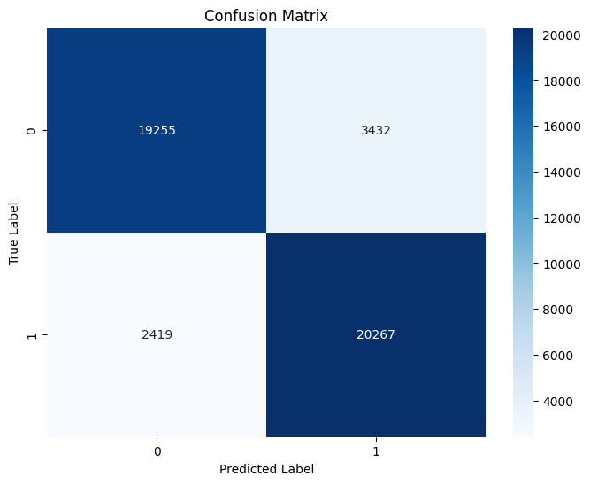
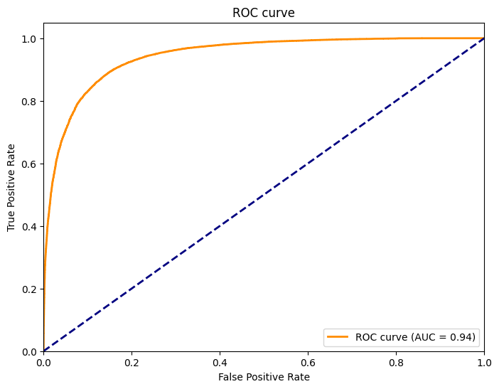
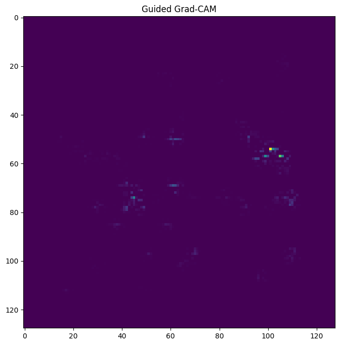

# 성능 평가 및 시각화 자료 분석

## CNN 모델 성능 분석

학습 데이터 양 : 45,373개 이미지 (피싱 : 22,686 / 정상 : 22,687)

- 정확도 (Accuracy) : 0.8710
- 정밀도 (Precision) : 0.8552
- 재현율 (Recall) : 0.8934
- F1 점수 (F1 Score) : 0.8739

### 1. Confusion Matrix

### 2. ROC Curve

## 시각화 자료 분석 및 실험 결과 가설

`./notebooks/visualizer.ipynb` 모듈로 시각화 자료 도출

시각화 자료 분석 & 모듈 코드 참고 : <https://velog.io/@tobigs_xai/CAM-Grad-CAM-Grad-CAMpp>

테스트 대상 이미지 : `./images/badqr.png` (실제 피싱 사이트를 QR 코드로 변환한 이미지, 학습에 사용 X)

### 1. 시각화 자료

#### Feature Map - Layer 1

#### Feature Map - Layer 2

#### Feature Map - Layer 3

#### Grad-CAM

#### Guided Grad-CAM

